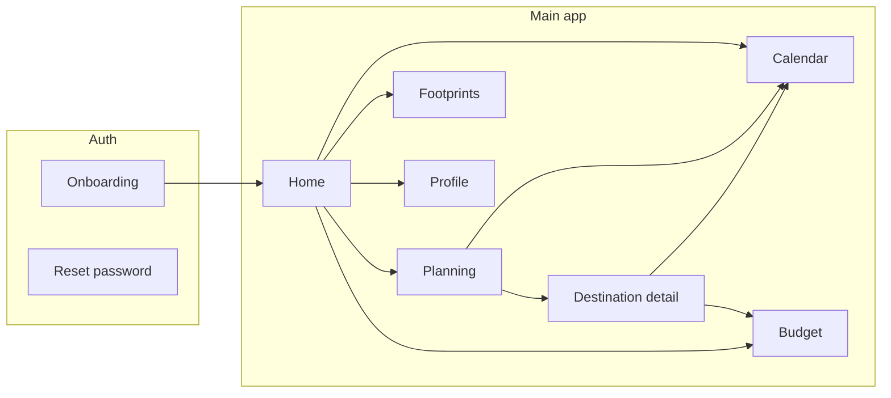

# OmniTrip — App workflow (narrative)

This document mirrors the **OmniTrip App Workflow** FigJam board and describes how the shipped app behaves. Use it for onboarding, QA, and keeping code and design in sync.

**FigJam (visual):** [OmniTrip App Workflow](https://www.figma.com/board/N4izVzULfnLX8BLHiKNy98/OmniTrip-App-Workflow?node-id=0-1)

---

## 1. Entry & auth

1. User lands on **Onboarding** (`/`): splash, sign in / sign up.
2. After auth, user enters the main shell (**AppLayout**): bottom nav + Buddy entry.
3. **Password reset:** email link → hash with `type=recovery` → session restored → **`/reset-password`** → new password → home.

---

## 2. Home (dashboard)

- Shows **active** or **planning** trip (prefer active); “Start Trip” for planning.
- Shortcuts to destinations, budget, calendar widgets, Buddy reflections.
- **Complete journey** moves trip to `completed` and refreshes state.

---

## 3. Planning → trip creation

1. **`/plan`** — natural language + optional constraints (budget, dates, intensity = activities per day).
2. AI suggests routes; user picks **Add This Trip** (or equivalent) → creates **trip**, **destinations**, **trip_days**, **activities** in Supabase.
3. **Planning state** is kept in **Zustand `planningStore`** so leaving for Calendar and returning does not wipe the studio UI.
4. Navigate to **destination detail** for the new itinerary.

---

## 4. Destination detail (itinerary)

- Day-by-day activities; tap to cycle status (planned → completed → skipped).
- **Accept** / sync rules: accepted (or relevant status) activities feed **calendar events** so the embedded calendar reflects the trip.
- **Deals & booking (hybrid):**
  - In-app **Stripe** path for bookable items where configured.
  - **Affiliate / external** links for flights, hotels, OTAs.
- After a successful booking, CTA evolves from **Add to trip**-style flow to **Go on your calendar** (or equivalent), opening **Calendar** with the right dates/events.

---

## 5. Calendar

- Month + timeline views; conflicts and resolutions where implemented.
- **Sync** opens **Calendar sync** UI:
  - **Add to calendar:** Google / Outlook deep links (zero-config), **.ics** download for Apple / others.
  - **Auto-sync:** per-user **subscription URL** backed by Supabase Edge Function **`calendar-feed`** and table **`calendar_subscriptions`** (secret `feed_token`).
- Optional route **`/auth/calendar/callback`** exists for future or legacy OAuth flows; primary UX is deep links + subscription feed.

---

## 6. Budget

- **`/budget`** — expenses, categories, charts; currency conversion where enabled.

---

## 7. Footprints (journeys & memory)

- **`/footprints`** — past trips, journal, **journey map** (destinations over time), **mood / vibe** visuals driven by travel history + insights service.

---

## 8. Profile & settings

- **`/profile`** — sections with explicit **Save** per card:
  - **Basic info** → `profiles` (`.update` by `id`; row must exist from signup trigger).
  - **Travel preferences**, **notifications**, **buddy tone** → `travel_profiles` (`.upsert` on `user_id`).
- Client state: **`profileStore`** (Zustand) so navigating away and back does not reset the form from stale local-only state.
- **Location services:** toggle **on** (request location + watch) / **off** (stop watch, clear coordinates in app). Browser permission still governed by the OS/browser; denied state shows guidance.

---

## 9. Buddy

- **Buddy panel:** chat, quick actions, POIs, voice where enabled.
- Proactive alerts tied to **location store** + POI pipeline (when enabled).

---

## High-level flow (diagram)

---

## Data touchpoints (quick reference)

| Area | Primary tables / APIs |
|------|----------------------|
| Auth | Supabase Auth |
| Profile basics | `profiles` |
| Travel prefs / buddy JSON | `travel_profiles` |
| Trips & itinerary | `trips`, `destinations`, `trip_days`, `activities` |
| Calendar UI | `calendar_events` |
| Calendar feed URL | `calendar_subscriptions` + Edge `calendar-feed` |
| Bookings / pay | `bookings`, Stripe Edge functions |
| Deals | `search-deals` (Amadeus), affiliate URLs |

---

*Last aligned with app behavior: repo `main` (see root README for version).*
